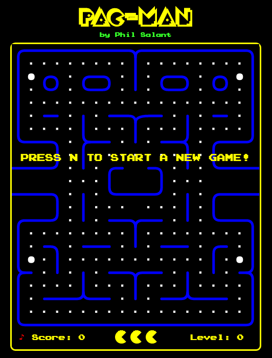

# Pac-Man
A clone of the popular arcade game Pac-Man.

[Pac-Man Live](http://www.philsalant.com/Pac-Man)

## Instructions
#### Gameplay
It's classic Pac-Man! Collect all the dots in the maze before encountering the four ghosts three times. Collecting a large blinking dot will cause the ghosts to become vulnerable to Pac-Man, so attack when they turn blue!

#### Controls
- Press "N" to start a new game.
- The arrow keys will control Pac-Man's direction.
- Press "S" to toggle the game's audio.



## Technologies and Techniques Used
- HTML5/CSS3
- HTML 5 Canvas
- Vanilla JavaScript
- Object-Oriented Programming

## Features and Implementation
### Maze Generator
The maze is generated dynamically, using a function to step through a series of JavaScript objects which contain methods and arguments to create HTML5 Canvas drawings. Because the instruction array is static, only one maze is ever drawn regardless of the level number. One possible future improvement would be to create additional instruction arrays which render different mazes for different levels.

#### The Function
```javascript
Maze.prototype.drawWall = function (ctx) {
  let i, j, p, line;
  ctx.strokeStyle = "#0000FF";
  ctx.lineWidth = 5;
  ctx.lineCap = "round";
  for (i = 0; i < Game.WALLS.length; i += 1) {
    line = Game.WALLS[i];
    ctx.beginPath();
    for (j = 0; j < line.length; j += 1) {
      p = line[j];
      if (p.move) {
        ctx.moveTo(p.move[0] * this.blockSize, p.move[1] * this.blockSize);
      } else if (p.line) {
        ctx.lineTo(p.line[0] * this.blockSize, p.line[1] * this.blockSize);
      } else if (p.curve) {
        ctx.quadraticCurveTo(
          p.curve[0] * this.blockSize,
          p.curve[1] * this.blockSize,
          p.curve[2] * this.blockSize,
          p.curve[3] * this.blockSize
        );
      }
    }
    ctx.stroke();
  }
};
```

#### The Instruction Array
```javascript
Game = {
  WALLS: [
    [
      { "move": [0, 9.5] }, { "line": [3, 9.5] },
      { "curve": [3.5, 9.5, 3.5, 9] }, { "line": [3.5, 8] },
      { "curve": [3.5, 7.5, 3, 7.5] }, { "line": [1, 7.5] },
      { "curve": [0.5, 7.5, 0.5, 7] }, { "line": [0.5, 1] },
      { "curve": [0.5, 0.5, 1, 0.5] }, { "line": [9, 0.5] },
      { "curve": [9.5, 0.5, 9.5, 1] }, { "line": [9.5, 3.5] }
    ],
    [
      { "move": [9.5, 1] },
      { "curve": [9.5, 0.5, 10, 0.5] }, { "line": [18, 0.5] },
      { "curve": [18.5, 0.5, 18.5, 1] }, { "line": [18.5, 7] },
      { "curve": [18.5, 7.5, 18, 7.5] }, { "line": [16, 7.5] },
      { "curve": [15.5, 7.5, 15.5, 8] }, { "line": [15.5, 9] },
      { "curve": [15.5, 9.5, 16, 9.5] }, { "line": [19, 9.5] }
    ],
    ......
  ]
}
```

### Audio Class
A custom audio class controls the playing of in-game audio and sound effects. Because the music playing while Pac-Man traverses the maze is actually a short audio clip that continuously loops, and because there are hundreds of re-renders during even a short stretch of the game, the built-in HTML audio would not suffice. There had to be a way to interrupt this looping momentarily, and then resume it after a different sound effect (like the ghost-eating sound) played. While HTML audio would pause and resume a normal audio file, the amount of rendering and re-rendering that takes place during the game coupled with the quickness with which the audio has to be paused and resumed made HTML audio too unreliable.

The custom Audio class contains familiar prototype methods like `play`, `pause`, and `resume`. The `resume` function was necessary because the `play` function restarts audio playback from the beginning of the first file. For this reason, there is also an `ended` function, which tracks which files have already played:

```javascript
Audio.prototype.ended = function (name) {
  let i, tmp = [], found = false;
  this.files[name].removeEventListener("ended", this.endEvents[name], true);
  for(i = 0; i < this.playing.length; i++) {
    if (!found && this.playing[i]) {
      found = true;
    } else {
      tmp.push(this.playing[i]);
    }
  }
  this.playing = tmp;
};
```

## Future Features
- High Scores, saved locally within the browser
- New Maze layouts for different levels
